<div align="center" padding=25px>
    
</div>

# <div align="center">AI-Driven Metropolis: Real-Time Demand Surge & Autonomous Dispatch</div>
## <div align="center">Lab Guide</div>
<br>

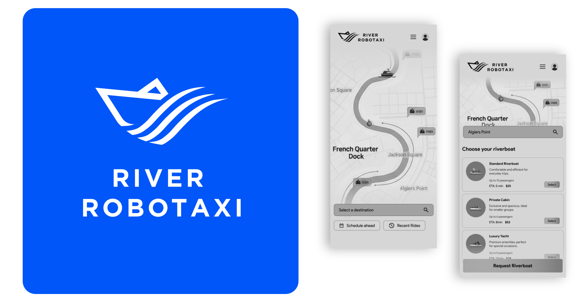

This demo showcases an intelligent, real-time fleet management system that autonomously detects demand surges, identifies their causes using AI-powered reasoning, and automatically dispatches vessels to meet increased demand. Built on [Confluent Intelligence](https://www.confluent.io/product/confluent-intelligence/), the system combines stream processing, anomaly detection, retrieval-augmented generation (RAG), and AI agent workflows to create a fully autonomous operations pipeline.
### What This System Does

The system continuously monitors ride request streams in real time and performs three key automated operations:

1. **Anomaly Detection** – Detects unusual spikes in ride requests across different zones using Flink’s [built-in ML functions](https://docs.confluent.io/cloud/current/ai/builtin-functions/overview.html).  
2. **Contextual Understanding** – Leverages [vector search](https://docs.confluent.io/cloud/current/ai/external-tables/vector-search.html) and RAG to uncover the reasons behind demand surges (e.g., events, conferences, festivals) by querying a knowledge base.  
3. **Autonomous Action** – Automatically dispatches docked vessels or repositions available ones to high-demand zones using [Streaming Agents](https://docs.confluent.io/cloud/current/ai/streaming-agents/overview.html) with tool calling.  

All of this runs in real time on **Confluent Cloud for Apache Flink**, with no external orchestration required.


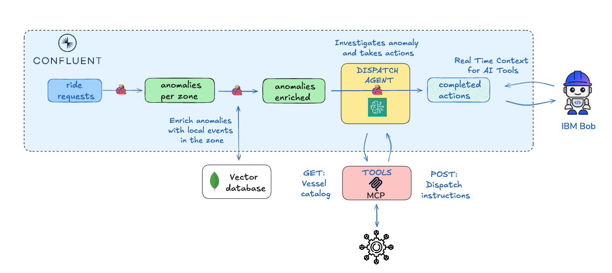

## **Agenda**

### Part 1 — AI-Driven Metropolis (Confluent Cloud + Flink)
1. [Log into Confluent Cloud](#step-1)
2. [Create an Environment and Cluster](#step-2)
3. [Create a Flink Compute Pool](#step-3)
4. [Create an API Key Pair](#step-4)
5. [Connect AI Agents, LLMs, and Vector Databases to Confluent](#step-5)
6. [Generate Ride Requests for AI Processing](#step-6)
7. [Detect Anomalies Using Built-In Flink Functions](#step-7)
8. [Invoke AI Models on Flink for Enrichment and Vector Search](#step-8)
9. [Execute Real-Time Decisions Using Streaming AI Agents](#step-9)
10. [Clean Up Resources](#step-10)
11. [Confluent Resources and Next Steps](#step-11)

### Part 2 — Real-Time Context Engine (RTCE) with IBM Bob
12. [Enable RTCE and Add API Keys](#step-12)
13. [Download and Install IBM Bob](#step-13)
14. [Set Up MCP Server in IBM Bob](#step-14)
15. [Query Data from Topic and Explore Schemas](#step-15)
***

## **Prerequisites**
<br>

1. Create a Confluent Cloud Account.
    - Sign up for a Confluent Cloud account [here](https://www.confluent.io/confluent-cloud/tryfree/).
    - Once you have signed up and logged in, click on the menu icon at the upper right hand corner, click on “Billing & payment”, then enter payment details under “Payment details & contacts”. A screenshot of the billing UI is included below.

2. Clone this repo:
   ```
   git clone git@github.com:confluentinc/ai-driven-metropolis.git
   ```
   or
   ```
   git clone https://github.com/confluentinc/ai-driven-metropolis.git
   ```

3. Install python based on your OS (https://www.python.org/downloads/)

> **Note:** You will create resources during this workshop that will incur costs. When you sign up for a Confluent Cloud account, you will get free credits to use in Confluent Cloud. This will cover the cost of resources created during the workshop. More details on the specifics can be found [here](https://www.confluent.io/confluent-cloud/tryfree/).

<div align="center" padding=25px>
    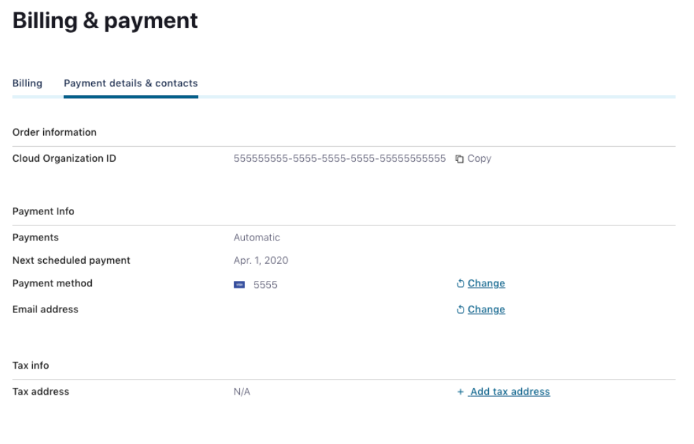
</div>


## <a name="step-1"></a>Log into Confluent Cloud

1. Log into [Confluent Cloud](https://confluent.cloud) and enter your email and password.

<div align="center" padding=25px>
    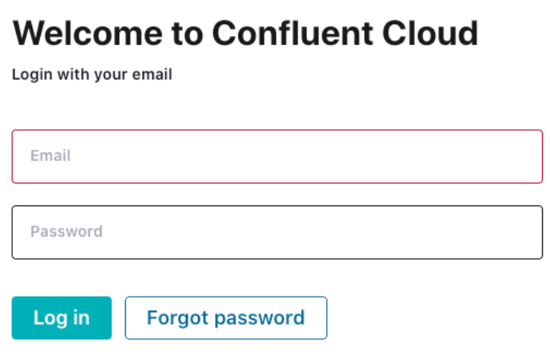
</div>

2. If you are logging in for the first time, you will see a self-guided wizard that walks you through spinning up a cluster. Please minimize this as you will walk through those steps in this workshop. 

***

### Part 1 — AI-Driven Metropolis (Confluent Cloud + Flink)

## <a name="step-2"></a>Create an Environment and Cluster

An environment contains clusters and its deployed components such as Apache Flink, Connectors, ksqlDB, and Schema Registry. You have the ability to create different environments based on your company's requirements. For example, you can use environments to separate Development/Testing, Pre-Production, and Production clusters. 

1. Click **+ Add Environment**. Specify an **Environment Name** and Click **Create**. 

>**Note:** There is a *default* environment ready in your account upon account creation. You can use this *default* environment for the purpose of this workshop if you do not wish to create an additional environment.

<div align="center" padding=25px>
    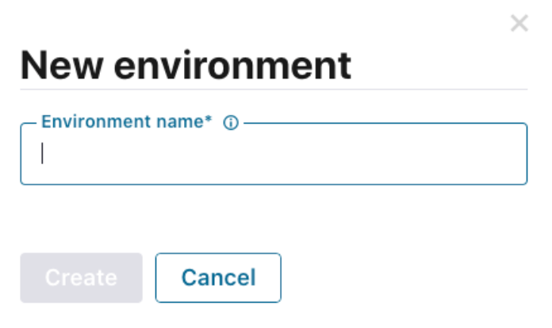
</div>

2. Now that you have an environment, click **Create Cluster**. 

> **Note:** Confluent Cloud clusters are available in 5 types: Basic, Standard, Enterprise , Dedicated and Freight. Basic is intended for development use cases so you will use that for the workshop. Basic clusters only support single zone availability. Standard , Enterprise, Dedicated and Freight clusters are intended for production use and support Multi-zone deployments. If you are interested in learning more about the different types of clusters and their associated features and limits, refer to this [documentation](https://docs.confluent.io/current/cloud/clusters/cluster-types.html).

3. Choose the **Basic** cluster type. 

<div align="center" padding=25px>
    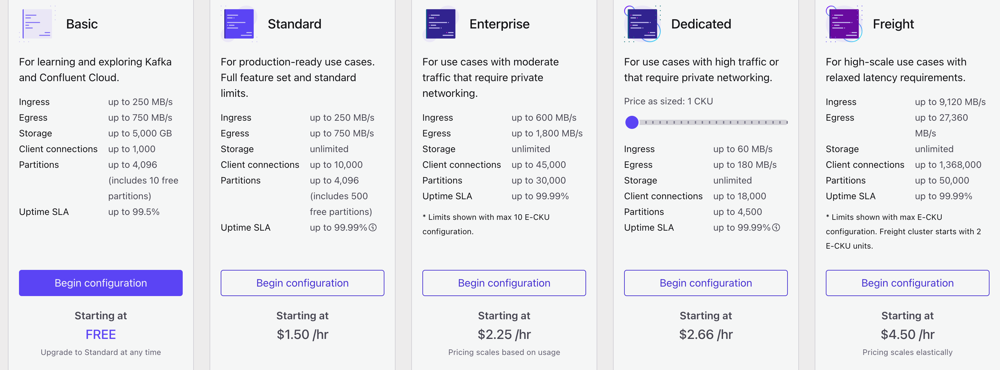
</div>

4. Click **Begin Configuration**. 
5. Choose **AWS** as preferred Cloud Provider, region (**us-east-1**), and availability zone. 
6. Specify a **Cluster Name**. For the purpose of this lab, any name will work here. 

<div align="center" padding=25px>
    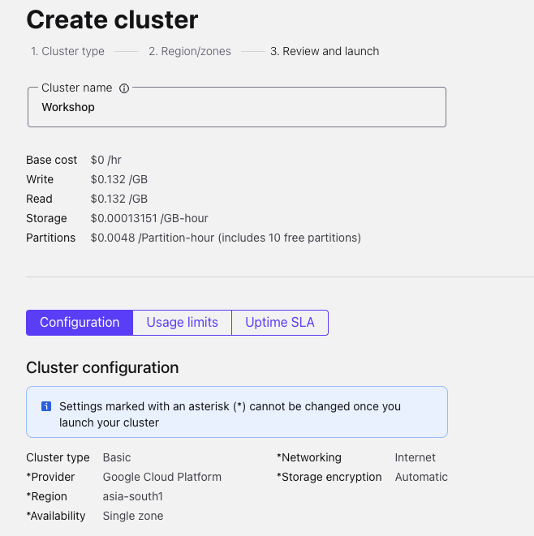
</div>

7. View the associated *Configuration & Cost*, *Usage Limits*, and *Uptime SLA* information before launching. 
8. Click **Launch Cluster**. 

***

## <a name="step-3"></a>Create a Flink Compute Pool

1. On the navigation menu, select **Flink** and click **Create Compute Pool**.

<div align="center" padding=25px>
    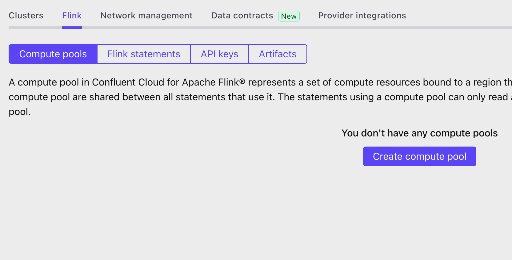
</div>

2. Select **Region** and then **Continue**. (You have to use the region where the cluster was created in the previous step)
<div align="center" padding=25px>
    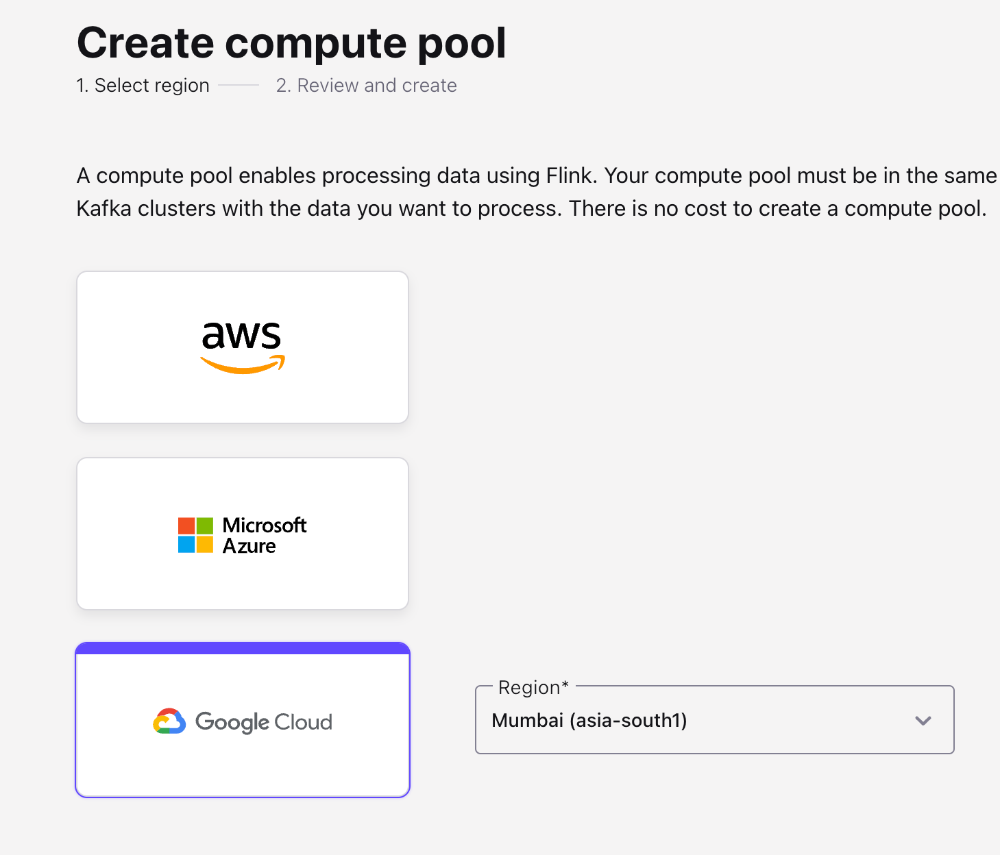
</div>

3.  Name your compute pool and set the capacity units (CFUs) to **10**. Click **Finish**.

<div align="center" padding=25px>
    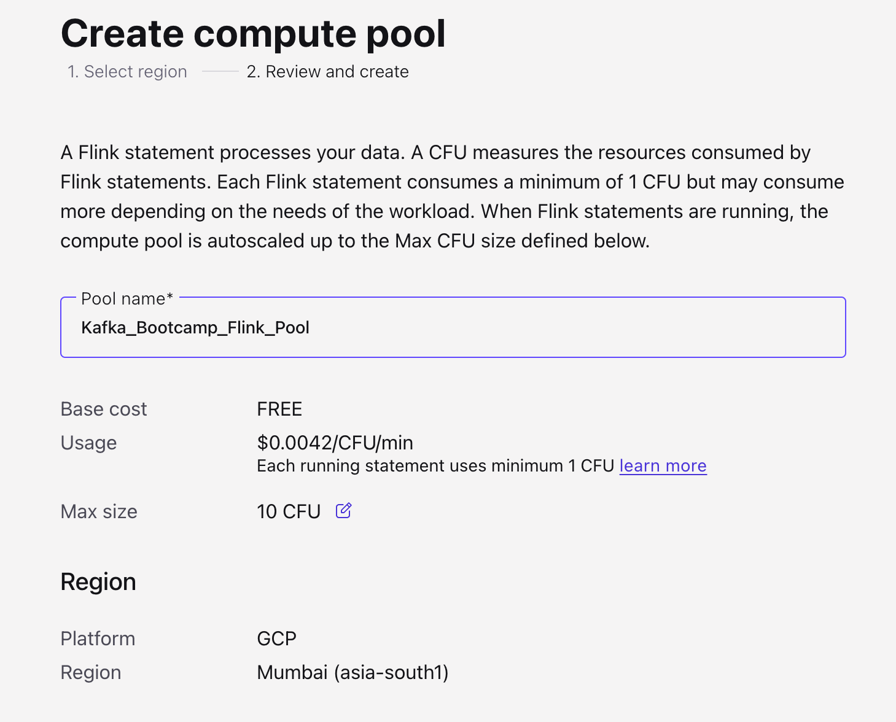
</div>

> **Note:** The capacity of a compute pool is measured in CFUs. Compute pools expand and shrink automatically based on the resources required by the statements using them. A compute pool without any running statements scale down to zero. The maximum size of a compute pool is configured during creation. 

4. Flink Compute pools will be ready shortly. You can click **Open SQL workspace** when the pool is ready to use.

5. Change your workspace name by clicking **settings button**. Click **Save changes** after you update the workspace name.

<div align="center" padding=25px>
    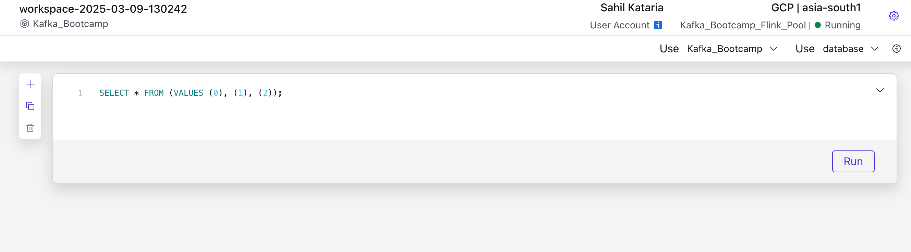
</div>

6. Set the Catalog as your environment name.

<div align="center" padding=25px>
    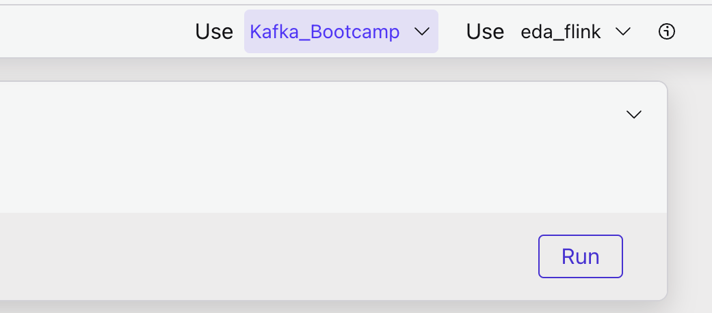
</div>

7. Set the Database as your cluster name.

<div align="center" padding=25px>
    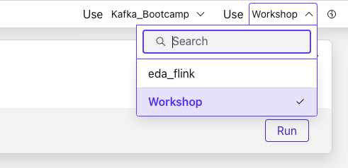
</div>

***

## <a name="step-4"></a>Create an API Key

1. Open the cluster page.
2. Click **API Keys** in the menu under *Cluster Overview*.
3. Click **Create Key** in order to create your first API Key. If you have an existing API Key, click **+ Add Key** to create another API Key.

<div align="center" padding=25px>
    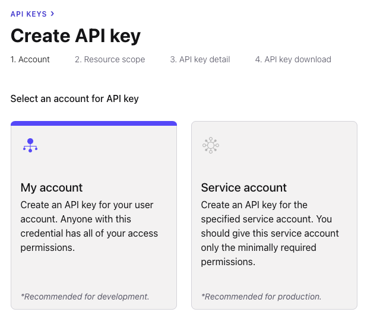
</div>

4. Select **My account** and then click **Next**.
5. Enter a description for your API Key (e.g. `API Key to source data from connectors`).

<div align="center" padding=25px>
    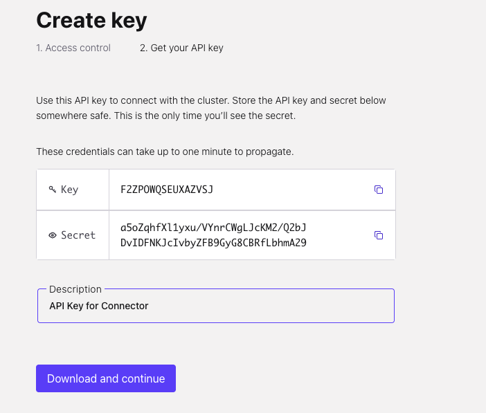
</div>

6. After creating and saving the API key, you will see this API key in the Confluent Cloud UI in the *API Keys* table. If you don't see the API key populate right away, try refreshing your browser.


## <a name="step-5"></a>Connect AI Agents, LLMs, and Vector Databases to Confluent

This step guides you through integrating your AI tools, LLMs, and vector databases with Confluent using Flink SQL. You will set up a connection to a MongoDB vector database, define the target table, and configure a Model Context Protocol (MCP) server connection to act as an external tool for your AI agents.

### Prerequisites
Ensure you have the appropriate Confluent Cloud or Flink environment active before running these SQL statements.

---

### 1. Establish Vector Database Connection

First, create a secure connection to the MongoDB cluster that stores your vector embeddings.

```sql
CREATE CONNECTION IF NOT EXISTS `mongodb-connection-lab3`
WITH (
  'type' = 'MONGODB',
  'endpoint' = 'mongodb+srv://cluster0.c79vrkg.mongodb.net/',
  'username' = 'workshop-user',
  'password' = '<MONGODB_PASSWORD>'
);
```

Create the Vector Database Table
Next, define the schema for the target vector database table.


```sql
CREATE TABLE IF NOT EXISTS documents_vectordb_lab3 (
  document_id STRING,
  chunk STRING,
  embedding ARRAY<FLOAT>
) WITH (
  'connector' = 'mongodb',
  'mongodb.connection' = 'mongodb-connection-lab3',
  'mongodb.database' = 'vector_search',
  'mongodb.collection' = 'documents',
  'mongodb.index' = 'vector_index',
  'mongodb.embedding_column' = 'embedding',
  'mongodb.numCandidates' = '500'
);
```

### 2. Connect to the Remote MCP Server

To enable your AI agents to communicate with external data sources and orchestrators dynamically, establish a connection to a remote Model Context Protocol (MCP) server.


```sql
CREATE CONNECTION IF NOT EXISTS `remote-mcp-connection`
WITH (
  'type' = 'MCP_SERVER',
  'endpoint' = 'https://z04yuqut2a.execute-api.us-east-1.amazonaws.com/mcp',
  'token' = '<MCP_SERVER_TOKEN>',
  'transport-type' = 'STREAMABLE_HTTP'
);
```


### 3. Configure LLMs and Embedding Models via AWS Bedrock

The next step is to configure your foundational models. You will set up the necessary IAM permissions in AWS and define the Flink SQL connections and models to leverage text generation and vector embedding capabilities directly inside Confluent.

Configure AWS IAM Permissions
Create an IAM User or Role in your AWS console with the following minimal policy to allow Flink to invoke Amazon Bedrock models:

```json
{
  "Version": "2012-10-17",
  "Statement": [
    {
      "Effect": "Allow",
      "Action": [
        "bedrock:InvokeModel",
        "bedrock:InvokeModelWithResponseStream"
      ],
      "Resource": "*"
    }
  ]
}
```

Text Embedding Connection
Create a connection targeting the Amazon Titan Text Embedding model:

```sql
CREATE CONNECTION `llm-embedding-connection`
WITH (
  'type' = 'bedrock',
  'endpoint' = 'https://bedrock-runtime.us-east-1.amazonaws.com/model/amazon.titan-embed-text-v1/invoke',
  'aws-access-key' = '<YOUR_AWS_ACCESS_KEY>',
  'aws-secret-key' = '<YOUR_AWS_SECRET_KEY>'
);
```

Text Generation Connection
Create a connection targeting the Anthropic Claude model endpoint:

```sql
CREATE CONNECTION `llm-textgen-connection`
WITH (
  'type' = 'bedrock',
  'endpoint' = 'https://bedrock-runtime.us-east-1.amazonaws.com/model/us.anthropic.claude-sonnet-4-5-20250929-v1:0/invoke',
  'aws-access-key' = '<YOUR_AWS_ACCESS_KEY>',
  'aws-secret-key' = '<YOUR_AWS_SECRET_KEY>'
);
```

Register the Embedding Model on Confluent Flink
Define the embedding model so you can generate vector embeddings from your text fields inline:

```sql
CREATE MODEL `llm_embedding_model` 
INPUT (text STRING) 
OUTPUT (embedding ARRAY<FLOAT>) 
WITH ( 
  'provider' = 'bedrock', 
  'task' = 'embedding', 
  'bedrock.connection' = 'llm-embedding-connection' 
);
```

Register the Text Generation Model
Define the language model to perform text generation tasks, summarizing, or parsing against incoming event streams:

```sql
CREATE MODEL `llm_textgen_model` 
INPUT (prompt STRING) 
OUTPUT (response STRING) 
WITH ( 
  'provider' = 'bedrock', 
  'task' = 'text_generation', 
  'bedrock.connection' = 'llm-textgen-connection', 
  'bedrock.params.max_tokens' = '50000' 
);
```

### 4. Create an MCP-Enabled Language Model

This model ties your Amazon Bedrock LLM together with the Model Context Protocol (MCP) server connection. This enables the language model to automatically discover and invoke the tools registered on the MCP server to fulfill user prompts dynamically during stream processing.

```sql
CREATE MODEL IF NOT EXISTS `remote_mcp_model`
INPUT (prompt STRING)
OUTPUT (response STRING)
WITH (
  'provider' = 'bedrock',
  'task' = 'text_generation',
  'bedrock.connection' = 'llm-textgen-connection',
  'bedrock.params.max_tokens' = '50000',
  'mcp.connection' = 'remote-mcp-connection'
);
```

## <a name="step-6"></a>Generate Ride Requests for AI Processing

To test the integration and stream data into your system, you need to execute the sample data generator script. This script acts as a producer that pushes ride request logs to Confluent Cloud.

Update the Configuration File
Before running the generator, you must update the local config.json file with your specific Confluent Cloud Kafka cluster endpoint, API keys, and Schema Registry details.

Update (common/datagen/config.json) file matching this structure:

```json
{
  "bootstrap_servers": "<YOUR_CONFLUENT_BOOTSTRAP_ENDPOINT_ENDING_WITH_9092>",
  "kafka_key": "<YOUR_KAFKA_CLUSTER_API_KEY>",
  "kafka_secret": "<YOUR_KAFKA_CLUSTER_API_SECRET>",
  "sr_url": "<YOUR_SCHEMA_REGISTRY_ENDPOINT_URL>",
  "sr_key": "<YOUR_SCHEMA_REGISTRY_API_KEY>",
  "sr_secret": "<YOUR_SCHEMA_REGISTRY_API_SECRET>"
}
```

Execute the Data Generator
Run the following script command in your terminal to start generating and streaming the simulated ride request datasets into Confluent Cloud:

```bash
python common/datagen/datagen.py --data-file common/datagen/ride_requests.jsonl --config common/datagen/config.json
```

## <a name="step-7"></a>Detect Anomalies Using Built-In Flink Functions

Visualize surge in `ride_requests` using `ML_DETECT_ANOMALIES`

This step identifies unexpected surges in ride requests for each pickup zone in real time using Flink's built-in anomaly detection function. We analyze ride request counts over 5-minute windows and compare them against expected baselines derived from historical trends.

Read the [documentation](https://docs.confluent.io/cloud/current/ai/builtin-functions/detect-anomalies.html) and view the [documentation](https://docs.confluent.io/cloud/current/flink/reference/functions/model-inference-functions.html#flink-sql-ml-anomaly-detect-function) on Flink anomaly detection for more details about how it works.

In the [Flink UI](https://confluent.cloud/go/flink), select your new environment and open a SQL workspace. Then, visualize the anomaly detection in action by running this query:

```sql
WITH windowed_traffic AS (
    SELECT
        window_start,
        window_end,
        window_time,
        pickup_zone,
        COUNT(*) AS request_count,
        SUM(number_of_passengers) AS total_passengers,
        SUM(CAST(price AS DECIMAL(10, 2))) AS total_revenue
    FROM TABLE(
        TUMBLE(TABLE ride_requests, DESCRIPTOR(request_ts), INTERVAL '5' MINUTE)
    )
    GROUP BY window_start, window_end, window_time, pickup_zone
)
SELECT
    pickup_zone,
    window_time,
    request_count,
    total_passengers,
    total_revenue,
    ML_DETECT_ANOMALIES(
        CAST(request_count AS DOUBLE),
        window_time,
        JSON_OBJECT(
            'minTrainingSize' VALUE 286,
            'maxTrainingSize' VALUE 7000,
            'confidencePercentage' VALUE 99.999,
            'enableStl' VALUE FALSE
        )
    ) OVER (
        PARTITION BY pickup_zone
        ORDER BY window_time
        RANGE BETWEEN UNBOUNDED PRECEDING AND CURRENT ROW
    ) AS anomaly_result
FROM windowed_traffic;
```

Click on the **anomaly_result** graph.

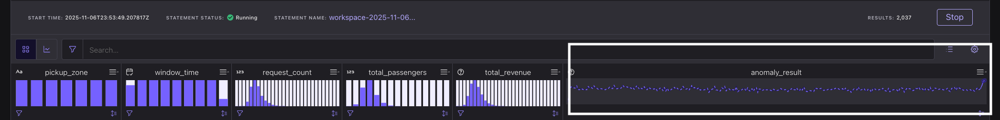

You will notice that there was an anomaly detected in one of the zones.

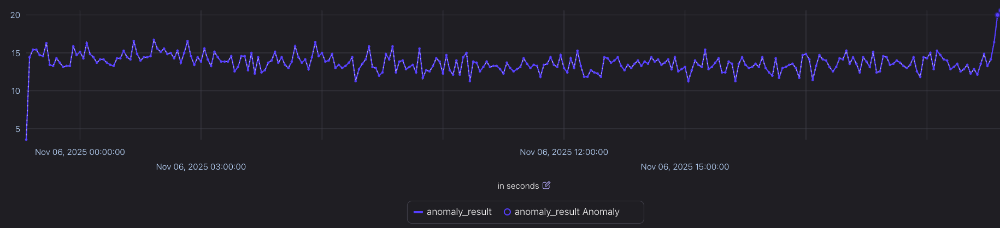

Now let's turn this into a continuous Flink job that filters for only the anomalies:

```sql
CREATE TABLE anomalies_per_zone AS
WITH windowed_traffic AS (
    SELECT
        window_start,
        window_end,
        window_time,
        pickup_zone,
        COUNT(*) AS request_count,
        SUM(number_of_passengers) AS total_passengers,
        SUM(CAST(price AS DECIMAL(10, 2))) AS total_revenue
    FROM TABLE(
        TUMBLE(TABLE ride_requests, DESCRIPTOR(request_ts), INTERVAL '5' MINUTE)
    )
    GROUP BY window_start, window_end, window_time, pickup_zone
),
anomaly_detection AS (
    SELECT
        pickup_zone,
        window_time,
        request_count,
        total_passengers,
        total_revenue,
        ML_DETECT_ANOMALIES(
            CAST(request_count AS DOUBLE),
            window_time,
            JSON_OBJECT(
                'minTrainingSize' VALUE 286,
                'maxTrainingSize' VALUE 7000,
                'confidencePercentage' VALUE 99.9,
                'enableStl' VALUE FALSE
            )
        ) OVER (
            PARTITION BY pickup_zone
            ORDER BY window_time
            RANGE BETWEEN UNBOUNDED PRECEDING AND CURRENT ROW
        ) AS anomaly_result
    FROM windowed_traffic
)
SELECT
    pickup_zone,
    window_time,
    request_count,
    total_passengers,
    total_revenue,
    CAST(ROUND(anomaly_result.forecast_value) AS BIGINT) AS expected_requests,
    anomaly_result.upper_bound AS upper_bound,
    anomaly_result.lower_bound AS lower_bound,
    anomaly_result.is_anomaly AS is_surge
FROM anomaly_detection
WHERE anomaly_result.is_anomaly = true
  AND request_count > anomaly_result.upper_bound;
```

> [!NOTE]
>
> Leave the query above running. Flink will typically take around five minutes to detect an anomaly. The reason for this is that we're detecting anomalies in 5-minute "windows", and we need to wait for the first window to close before Flink can detect one.

In a new cell, run the following to view the results.

```sql
SELECT * FROM anomalies_per_zone
```

You should see an anomaly in the `French Quarter` zone.

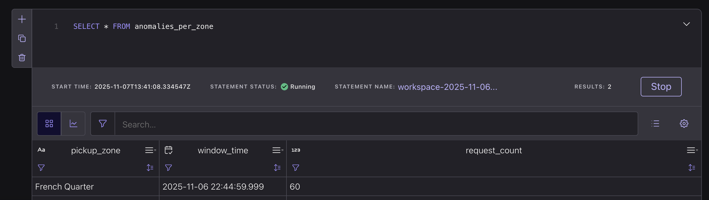

These detected surges are then used as triggers for the next steps — contextual understanding and agentic vessel movement.


## <a name="step-8"></a>Invoke AI Models on Flink for Enrichment and Vector Search
Anomaly detection: Enrich `anomalies_per_zone` with possible causes of the anomaly using vector search

Once a surge is detected, we want to **understand why** it happened. This step enriches detected anomalies with real-world context using **Vector Search** and **LLM-based reasoning**. These detected surges are then used as triggers for the next steps — contextual understanding and agentic vessel movement.

The query takes each detected surge and formulates a natural language query describing the anomaly (e.g., *"Transportation demand surge in French Quarter zone at 8:00 PM…"*). It then embeds that query using an **LLM embedding model** and searches a **vector database** of local event data (e.g., concerts, conferences, or sports games) to find the most relevant documents.

Finally, it uses an **LLM text generation model** to summarize the results into a concise, human-readable explanation of the likely cause for the surge.

```sql
CREATE TABLE anomalies_enriched
WITH ('changelog.mode' = 'append')
AS SELECT
    pickup_zone,
    window_time,
    request_count,
    expected_requests,
    anomaly_reason,
    top_chunk_1,
    top_chunk_2,
    top_chunk_3
FROM (
    SELECT
        rad_with_rag.pickup_zone,
        rad_with_rag.window_time,
        rad_with_rag.request_count,
        rad_with_rag.expected_requests,
        rad_with_rag.is_surge,
        TRIM(llm_response.response) AS anomaly_reason,
        rad_with_rag.top_chunk_1,
        rad_with_rag.top_chunk_2,
        rad_with_rag.top_chunk_3
    FROM (
        SELECT
            rad.pickup_zone,
            rad.window_time,
            rad.request_count,
            rad.expected_requests,
            rad.is_surge,
            rad.query,
            vs.search_results[1].document_id AS top_document_1,
            vs.search_results[1].chunk AS top_chunk_1,
            vs.search_results[1].score AS top_score_1,
            vs.search_results[2].document_id AS top_document_2,
            vs.search_results[2].chunk AS top_chunk_2,
            vs.search_results[2].score AS top_score_2,
            vs.search_results[3].document_id AS top_document_3,
            vs.search_results[3].chunk AS top_chunk_3,
            vs.search_results[3].score AS top_score_3
        FROM (
            SELECT
                pickup_zone,
                window_time,
                request_count,
                expected_requests,
                is_surge,
                CONCAT(
                    'Transportation demand surge in ',
                    pickup_zone,
                    ' at ',
                    DATE_FORMAT(window_time, 'h:mm a'),
                    ' (',
                    DATE_FORMAT(window_time, 'HH:mm'),
                    ') during ',
                    CASE
                        WHEN HOUR(window_time) >= 0 AND HOUR(window_time) < 4 THEN 'late night hours (12:00 AM - 4:00 AM)'
                        WHEN HOUR(window_time) >= 4 AND HOUR(window_time) < 7 THEN 'early morning setup period (4:00 AM - 7:00 AM)'
                        WHEN HOUR(window_time) >= 7 AND HOUR(window_time) < 9 THEN 'morning rush hours (7:00 AM - 9:00 AM)'
                        WHEN HOUR(window_time) >= 9 AND HOUR(window_time) < 12 THEN 'late morning period (9:00 AM - 12:00 PM)'
                        WHEN HOUR(window_time) >= 12 AND HOUR(window_time) < 14 THEN 'lunch service peak (12:00 PM - 2:00 PM)'
                        WHEN HOUR(window_time) >= 14 AND HOUR(window_time) < 17 THEN 'afternoon hours (2:00 PM - 5:00 PM)'
                        WHEN HOUR(window_time) >= 17 AND HOUR(window_time) < 20 THEN 'evening dinner period (5:00 PM - 8:00 PM)'
                        WHEN HOUR(window_time) >= 20 AND HOUR(window_time) < 23 THEN 'nightlife hours (8:00 PM - 11:00 PM)'
                        ELSE 'late night period (11:00 PM - 12:00 AM)'
                    END,
                    '. Looking for HIGH demand events occurring between ',
                    DATE_FORMAT(window_time - INTERVAL '1' HOUR, 'h:mm a'),
                    ' and ',
                    DATE_FORMAT(window_time + INTERVAL '1' HOUR, 'h:mm a'),
                    '. Expected: ',
                    CAST(expected_requests AS STRING),
                    ', Actual: ',
                    CAST(request_count AS STRING),
                    ' (+',
                    CAST(ROUND(((request_count - expected_requests) / expected_requests) * 100, 1) AS STRING),
                    '%). What HIGH impact events, festivals, or gatherings are active in ',
                    pickup_zone,
                    ' during this time?'
                ) AS query,
                emb.embedding
            FROM anomalies_per_zone,
            LATERAL TABLE(ML_PREDICT('llm_embedding_model',
                CONCAT(
                    'Transportation demand surge in ',
                    pickup_zone,
                    ' at ',
                    DATE_FORMAT(window_time, 'h:mm a'),
                    ' (',
                    DATE_FORMAT(window_time, 'HH:mm'),
                    ') during ',
                    CASE
                        WHEN HOUR(window_time) >= 0 AND HOUR(window_time) < 4 THEN 'late night hours (12:00 AM - 4:00 AM)'
                        WHEN HOUR(window_time) >= 4 AND HOUR(window_time) < 7 THEN 'early morning setup period (4:00 AM - 7:00 AM)'
                        WHEN HOUR(window_time) >= 7 AND HOUR(window_time) < 9 THEN 'morning rush hours (7:00 AM - 9:00 AM)'
                        WHEN HOUR(window_time) >= 9 AND HOUR(window_time) < 12 THEN 'late morning period (9:00 AM - 12:00 PM)'
                        WHEN HOUR(window_time) >= 12 AND HOUR(window_time) < 14 THEN 'lunch service peak (12:00 PM - 2:00 PM)'
                        WHEN HOUR(window_time) >= 14 AND HOUR(window_time) < 17 THEN 'afternoon hours (2:00 PM - 5:00 PM)'
                        WHEN HOUR(window_time) >= 17 AND HOUR(window_time) < 20 THEN 'evening dinner period (5:00 PM - 8:00 PM)'
                        WHEN HOUR(window_time) >= 20 AND HOUR(window_time) < 23 THEN 'nightlife hours (8:00 PM - 11:00 PM)'
                        ELSE 'late night period (11:00 PM - 12:00 AM)'
                    END,
                    '. Looking for HIGH demand events occurring between ',
                    DATE_FORMAT(window_time - INTERVAL '1' HOUR, 'h:mm a'),
                    ' and ',
                    DATE_FORMAT(window_time + INTERVAL '1' HOUR, 'h:mm a'),
                    '. Expected: ',
                    CAST(expected_requests AS STRING),
                    ', Actual: ',
                    CAST(request_count AS STRING),
                    ' (+',
                    CAST(ROUND(((request_count - expected_requests) / expected_requests) * 100, 1) AS STRING),
                    '%). What HIGH impact events, festivals, or gatherings are active in ',
                    pickup_zone,
                    ' during this time?'
                )
            )) AS emb
            WHERE is_surge = true
        ) AS rad,
        LATERAL TABLE(
            VECTOR_SEARCH_AGG(
                documents_vectordb_lab3,
                DESCRIPTOR(embedding),
                rad.embedding,
                3
            )
        ) AS vs
    ) AS rad_with_rag,
    LATERAL TABLE(
        ML_PREDICT(
            'llm_textgen_model',
            CONCAT(
                'Analyze the retrieved event documents and identify the most likely cause of this transportation demand surge. If a retrieved document describes an event with time ranges that overlap the surge time, cite it by name, attendance, and time. If no document is a strong match, describe the surge itself: the zone, the time of day, and the magnitude. Always provide a concise 1-2 sentence answer that gives the dispatch agent enough context to act. Do not say "no events found" — always produce a reason.\n\n',
                'USER QUERY: ', rad_with_rag.query, '\n\n',
                'RETRIEVED DOCUMENTS:\n',
                'Document 1 (Score: ', CAST(rad_with_rag.top_score_1 AS STRING), '):\n',
                'Source: ', rad_with_rag.top_document_1, '\n',
                rad_with_rag.top_chunk_1, '\n\n',
                'Document 2 (Score: ', CAST(rad_with_rag.top_score_2 AS STRING), '):\n',
                'Source: ', rad_with_rag.top_document_2, '\n',
                rad_with_rag.top_chunk_2, '\n\n',
                'Document 3 (Score: ', CAST(rad_with_rag.top_score_3 AS STRING), '):\n',
                'Source: ', rad_with_rag.top_document_3, '\n',
                rad_with_rag.top_chunk_3, '\n\n',
                'Provide only the reason, no additional text.'
            )
        )
    ) AS llm_response
);
```

> NOTE: Leave the query running so that it runs continuously.

## <a name="step-9"></a>Execute Real-Time Decisions Using Streaming AI Agents

Agent Definition: Run `CREATE TOOL` and `CREATE AGENT` to define agent tools, prompt, and capabilities

Once anomalies have been detected and enriched with context, the system can act on them automatically using Streaming Agents. We can trigger specific operational workflows — for example, dispatching idle vessels from nearby docks to high-demand zones.

These agents leverage tool calling to interact directly with external systems or APIs, enabling closed-loop automation — all running natively within Confluent Cloud for Apache Flink.

See [CREATE TOOL documentation](https://docs.confluent.io/cloud/current/flink/reference/statements/create-tool.html).

```sql
CREATE TOOL lab3_remote_mcp
USING CONNECTION `remote-mcp-connection`
WITH (
  'type' = 'mcp',
  'allowed_tools' = 'http_get, http_post',
  'request_timeout' = '30'
);
```

See [CREATE AGENT documentation](https://docs.confluent.io/cloud/current/flink/reference/statements/create-agent.html#flink-sql-create-agent).
```sql
CREATE AGENT `boat_dispatch_agent`
USING MODEL `remote_mcp_model`
USING PROMPT 'You are an intelligent boat dispatch coordinator for a riverboat ride-sharing service.

Your workflow:
1. ANALYZE the surge information provided (zone, time, request count). Use the anomaly reason as background context if available, but do not rely on it to proceed.
2. REVIEW the available vessels list by using the http_get tool to fetch "https://p8jrtzaj78.execute-api.us-east-1.amazonaws.com/prod/api/vessel_catalog"
3. SELECT appropriate boats to dispatch based on:
   - Proximity to the target zone
   - Boat capacity
   - Current availability
   - Surge magnitude (dispatch up to 8 boats for large surges)
4. CREATE a JSON dispatch request with this exact structure:
   {
     "action": "dispatch_boats",
     "zone": "<target_zone>",
     "boats": [
       {
         "vessel_id": "<vessel_id>",
         "new_zone": "<target_zone>",
         "new_availability": "available"
       }
     ]
   }
5. USE the http_post tool to POST the dispatch request to:
   URL: https://p8jrtzaj78.execute-api.us-east-1.amazonaws.com/prod/api/dispatch
   Body: <your generated JSON>

6. FORMAT your final response with these THREE sections:

Dispatch Summary:
Due to the surge in demand in [zone] as a result of [event], we dispatched [n] additional boats from [list of zones].

Dispatch JSON:
{your dispatch JSON here}

API Response:
{the response from the API call}

CRITICAL INSTRUCTIONS:
- Dispatch boats from nearby zones first
- Dispatch more boats with larger capacities for big surges (up to 8 boats)
- Your response MUST contain the three labeled sections
- The dispatch JSON must be valid and contain only the structure shown above
- Always execute the POST request and include the API response
- Do NOT include any other explanatory text outside these three sections
- The anomaly reason describes the likely cause of the surge but may be uncertain or generic — it is context only, NOT a required input. If it is vague or unclear, proceed with dispatching using the zone and request count alone.
- NEVER ask for clarification. You always have enough information to dispatch: the zone name and surge magnitude are always present. Act immediately.'
USING TOOLS `lab3_remote_mcp`
WITH (
  'max_iterations' = '10'
);
```

Invoke the agent with `AI_RUN_AGENT`

Start the agent with the `AI_RUN_AGENT` command to start taking action on any anomalies the moment that Flink detects them.See [AI_RUN_AGENT documentation](https://docs.confluent.io/cloud/current/flink/reference/functions/model-inference-functions.html#flink-sql-ai-run-agent-function).
```sql
CREATE TABLE completed_actions (
    PRIMARY KEY (pickup_zone) NOT ENFORCED
)
WITH ('changelog.mode' = 'append')
AS SELECT
    pickup_zone,
    window_time,
    request_count,
    anomaly_reason,
    TRIM(REGEXP_EXTRACT(CAST(response AS STRING), '\*{0,2}Dispatch Summary:\*{0,2}\s*\n([\s\S]+?)(?=\n\n\*{0,2}Dispatch JSON:\*{0,2})', 1)) AS dispatch_summary,
    TRIM(REGEXP_EXTRACT(CAST(response AS STRING), '\*{0,2}Dispatch JSON:\*{0,2}\s*\n(?:```json\s*)?([\s\S]+?)(?:```)?(?=\n\n\*{0,2}API Response:\*{0,2})', 1)) AS dispatch_json,
    TRIM(REGEXP_EXTRACT(CAST(response AS STRING), '\*{0,2}API Response:\*{0,2}\s*\n(?:```json\s*)?([\s\S]+?)(?:```)?$', 1)) AS api_response,
    CAST(response AS STRING) AS raw_response
FROM anomalies_enriched,
LATERAL TABLE(AI_RUN_AGENT(
    `boat_dispatch_agent`,
    `anomaly_reason`,
    `pickup_zone`
));
```

Then view the `dispatch_summary`, `dispatch_json`, `api_response`, and `raw_response` columns from the streaming agent's output.
```sql
SELECT * FROM `completed_actions`;
```

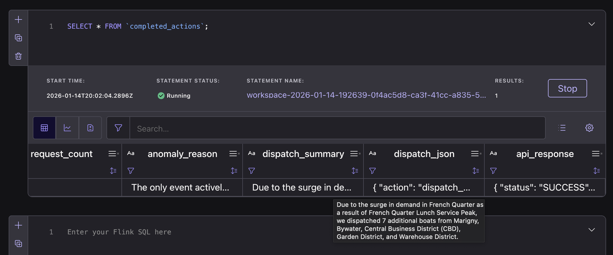

## Conclusion

By chaining these intelligent streaming components together, we’ve built an always-on, real-time, context-aware agentic pipeline that detects ride request demand surges, explains their causes, and takes autonomous action — all within seconds.

---

# Part 2 — Real-Time Context Engine (RTCE) with IBM Bob

In Part 2, you will enable Confluent's **Real-Time Context Engine (RTCE)** on one of the topics created in Part 1, then use **IBM Bob** as an AI assistant to query that live data through an MCP server — without writing any code.

> **What is RTCE?**  
> The Real-Time Context Engine exposes Kafka topics as a semantic, queryable data source. It automatically indexes messages, understands their schema, and provides an MCP-compatible endpoint so any MCP-aware AI tool can read, filter, and reason over your streaming data in real time.

> **What is IBM Bob?**  
> IBM Bob is an AI-powered assistant that supports the Model Context Protocol (MCP), allowing it to connect to live data sources and answer natural language questions against them.

---

## <a name="step-12"></a>Enable RTCE and Add API Keys

1. In **Confluent Cloud**, navigate to the environment you created in Part 1.
2. Open the **Topics** list. You will see a **Context engine** column showing whether RTCE is enabled for each topic.

<div align="center" padding=25px>
    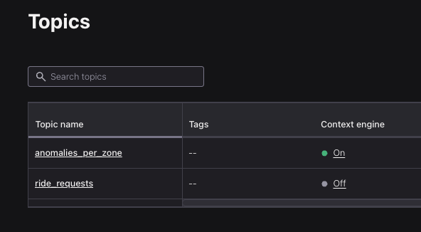
</div>

3. Select the topic you want to expose — for this exercise use `completed_actions`.
4. In the topic detail view, click the **Context engine** toggle to enable RTCE. A dialog will appear confirming the enablement details (topic name, environment, cluster, cloud, and region).

<div align="center" padding=25px>
    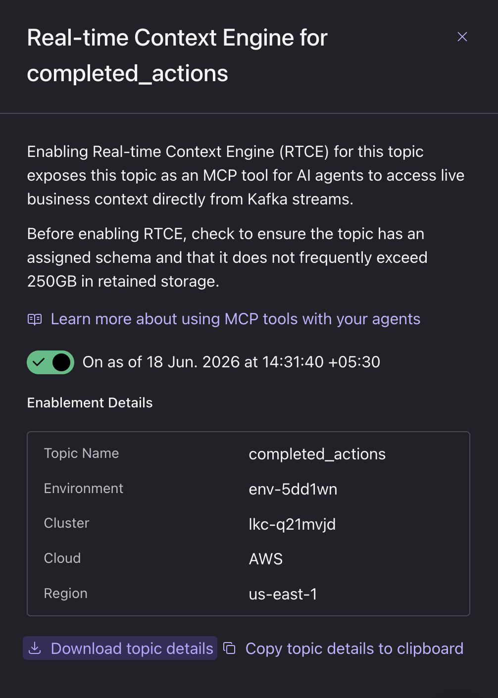
</div>

> **Note:** Before enabling RTCE, ensure the topic has an assigned schema and does not frequently exceed 250 GB in retained storage.

5. Click **Download topic details** or **Copy topic details to clipboard** to save the connection credentials — you will need them in Step 14.
6. The RTCE endpoint URL follows the pattern:
   ```
   https://mcp.<REGION>.aws.confluent.cloud/mcp/v1/context-engine/organizations/<ORG_ID>/environments/<ENV_ID>/kafka-clusters/<LKC_ID>
   ```
7. Create a Global API key
    1. Open the Administration menu in the upper-right corner and select API keys.
    2. Click + Add API key.
    3. For Name, enter a name for the API key.
    4. Optionally, for Description, enter a description.
    5. Under Select account, select My account.
    6. Under Select key scope, select Global.
    7. Click Create API key.
    8. Download or copy the API key and secret. After you close this dialog, the secret is no longer available.
   
8. Generate the Base64 token
    ```shell
    export KEY=<API_KEY>
    export SECRET=<API_SECRET>
    export TOKEN=$(echo -n "${KEY}:${SECRET}" | base64)
    echo $TOKEN
    ```
    Save this token for later use.
---

## <a name="step-13"></a>Download and Install IBM Bob

1. Go to [https://bob.ibm.com](https://bob.ibm.com) and sign in with your IBM ID (or create a free account with your personal email).
2. Download the **IBM Bob** desktop application for your operating system (macOS, Windows, or Linux).
3. Run the installer and follow the on-screen instructions to complete the installation.
4. Launch IBM Bob and sign in with your IBM ID.

---

## <a name="step-14"></a>Set Up MCP Server in IBM Bob

IBM Bob supports MCP servers as external data connections. You will register the RTCE endpoint as an MCP server so Bob can query your Kafka topic in real time.

1. In IBM Bob, open **Settings** on the right panel → **MCP Servers** (or **Integrations** → **MCP**).
2. Click **Open on Global MCP tab** and paste in the following with the details for your mcp server:

   ```json
    {
    "mcpServers": {
        "confluent-rtce": {
        "type": "streamable-http",
        "url": "https://mcp.<REGION>.aws.confluent.cloud/mcp/v1/context-engine/organizations/<ORG_ID>/environments/<ENV_ID>/kafka-clusters/<LKC_ID>",
        "headers": {
            "Authorization": "Basic <TOKEN>"
        }
        }
    }
    }
   ```

3. Click Save and verify that IBM Bob can successfully connect to the RTCE endpoint. Once the connection is established, a new MCP server will appear with a green status indicator, as shown below.
<div align="center" padding=25px>
    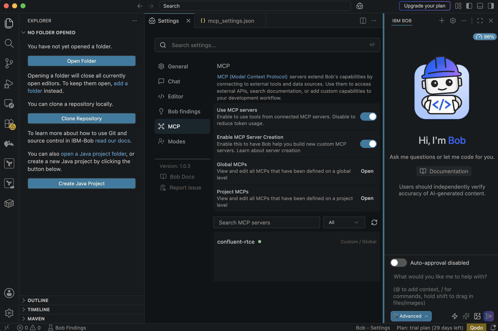
</div>
4. Once the connection shows **Connected**, you are ready to query.

---

## <a name="step-15"></a>Query Data from Topic and Explore Schemas

With the MCP server configured, IBM Bob can answer natural language questions against your live Kafka topic.

### Discover Available Topics

Start by asking Bob what topics are available:

> *"What topics are available?"*

Bob will call the `listTopics` tool on the `confluent-rtce` MCP server and return all online topics — for example `completed_actions` and other topics you have rtce enabled on.

<div align="center" padding=25px>
    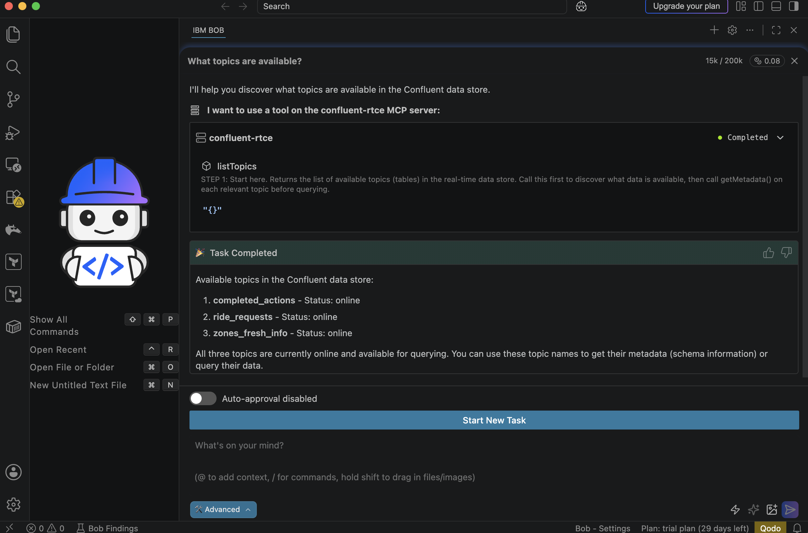
</div>

### View Topic Schema

Ask Bob to describe the structure of a topic:

> *"What is the schema of the `completed_actions` topic?"*

Bob will return the field names, data types, and a sample record from the topic — pulled live from RTCE.

### Query Recent Records

Retrieve recent events from the topic:

> *"Show me the last 10 messages from `completed_actions`."*

### Explore Anomalies

If you left the anomaly detection job running from Part 1 , you can enable rtce on `anomalies_enriched` topic and query :

> *"Are there any anomalies in `anomalies_enriched` right now?"*

> *"What is the anomaly reason for the most recent surge?"*

### Cross-Topic Analysis

You can enable rtce on multiple topics and perfome complex queries:

> *"Which zones had the highest request count in the last 5 minutes?"*

> *"What actions were taken by the dispatch agent in `completed_actions`?"*

Bob will use RTCE to fetch, filter, and reason over the live streaming data and return grounded, up-to-date answers.

## Confluent RTCE + IBM Bob — Resources

- [Real-Time Context Engine Overview](https://docs.confluent.io/cloud/current/ai/real-time-context-engine/overview.html#real-time-context-engine) — Official Confluent documentation for RTCE, including setup, API reference, and MCP integration details.
- [IBM Bob](https://bob.ibm.com/) — IBM's AI assistant with MCP support for querying live data sources.

***


## <a name="step-10"></a>Clean Up Resources

Deleting the resources you created during this workshop will prevent you from incurring additional charges. 

1. The first item to delete is the Apache Flink Compute Pool. Select the **Delete** button under **Actions** and enter the **Application Name** to confirm the deletion. 
<div align="center">
    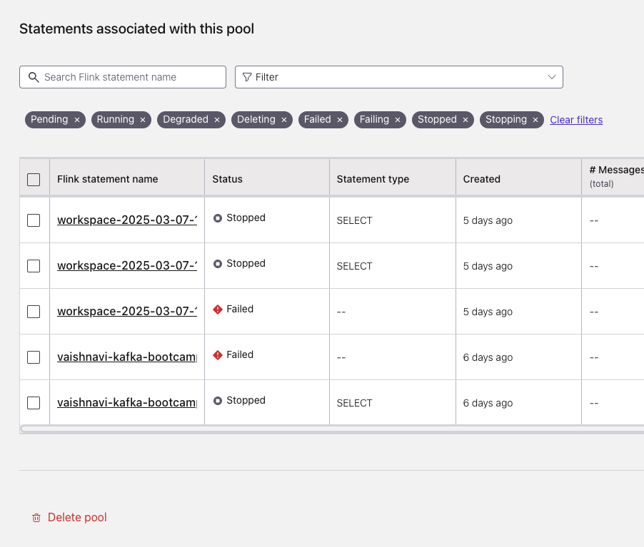
</div>


2. Next, under **Cluster Settings**, select the **Delete Cluster** button at the bottom. Enter the **Cluster Name** and select **Confirm**. 
<div align="center">
    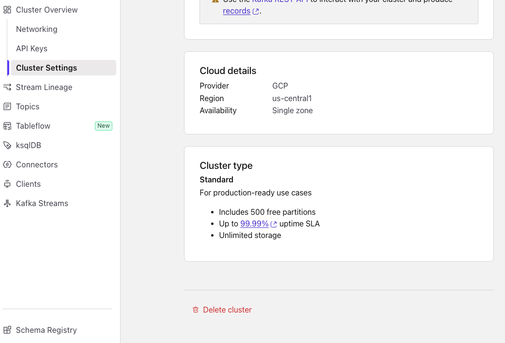
</div>

3. Finally, to remove all resource pertaining to this workshop, delete the environment.
<div align="center">
    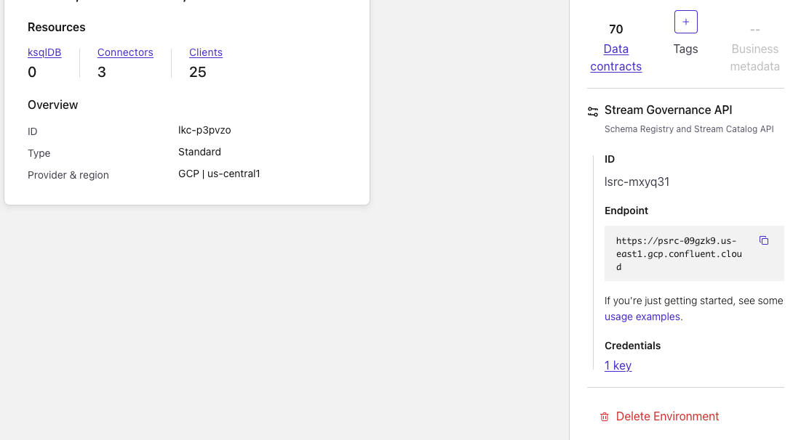
</div>

*** 

## <a name="step-11"></a>Confluent Resources and Further Testing

Here are some links to check out if you are interested in further testing:
- [Confluent Cloud Documentation](https://docs.confluent.io/cloud/current/overview.html)
- [Apache Flink 101](https://developer.confluent.io/courses/apache-flink/intro/)
- [Stream Processing with Confluent Cloud for Apache Flink](https://docs.confluent.io/cloud/current/flink/index.html)
- [Flink SQL Reference](https://docs.confluent.io/cloud/current/flink/reference/overview.html)
- [Flink SQL Functions](https://docs.confluent.io/cloud/current/flink/reference/functions/overview.html)
- [Flink GenAI](https://www.confluent.io/blog/flinkai-realtime-ml-and-genai-confluent-cloud/)

***
---